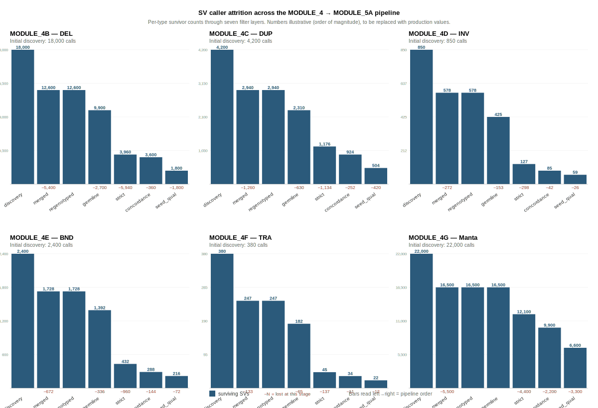

# SV Calling Framework — Shared Wiki

Cross-cutting reference for everything related to SV calling in this pipeline. Every per-module wiki under `MODULE_4*/WIKI.md` links here for shared concepts (junction.h logic, CT semantics, BISER2/minimap2, population binomial, DELLY×Manta concordance) rather than duplicating them.

**Read this first if you are:**
- New to the repo and want to understand how the SV layer works
- Writing the methods section of the manuscript
- Trying to debug a caller-output question that spans multiple modules

**Skip to a per-module wiki if you are:**
- Looking for filter thresholds or run instructions for one module → that module's `WIKI.md`
- Working on the inversion paper specifically → start at `MODULE_4D_delly_inv/WIKI.md` (the central one) and follow links here

---

## Table of contents

1. [Verified filter thresholds (production code)](#1-verified-filter-thresholds-production-code)
2. [How DELLY classifies SVs from split reads (`junction.h` dissected)](#2-how-delly-classifies-svs-from-split-reads-junctionh-dissected)
   - [2A — `selectDeletions` → DEL](#2a--selectdeletions--del)
   - [2B — `selectDuplications` → DUP](#2b--selectduplications--dup)
   - [2C — `selectInversions` → INV (3to3 / 5to5)](#2c--selectinversions--inv-3to3--5to5)
   - [2D — `selectInsertions` + `bridgeInsertions` → INS (DELLY, dropped)](#2d--selectinsertions--bridgeinsertions--ins-delly-dropped)
   - [2E — `selectTranslocations` → BND / TRA](#2e--selecttranslocations--bnd--tra)
   - [Summary table](#summary-table-junctionh-conditions-per-sv-type)
3. [What each caller/module contributes (plug-map)](#3-what-each-callermodule-contributes-plug-map)
4. [BISER2 and minimap2 — methods for SD detection](#4-biser2-and-minimap2--methods-for-sd-detection)
5. [Filter attrition through the pipeline (UpSetR)](#5-filter-attrition-through-the-pipeline-upsetr)
6. [Summary tables (for manuscript writing)](#6-summary-tables-for-manuscript-writing)
7. [Open items requiring confirmation](#7-open-items-requiring-confirmation)

---

## 1. Verified filter thresholds (production code)

The strict catalog filters below are what the live pipeline applies. Values verified against `Modules/MODULE_4*/00_module*_config.sh` and `Modules/MODULE_4*/slurm/SLURM_A03_merge_genotype.sh`.

| Module | File | `STRICT_MIN_QUAL` | `STRICT_MIN_PE` | `PRECISE` required |
|---|---|---|---|---|
| MODULE_4B DEL | `00_module4b_config.sh` line 115–116 | **500** | **5** | yes |
| MODULE_4C DUP | `00_module4c_config.sh` line 44–45 | **500** | **5** | **no** (commented alt is 300/3) |
| MODULE_4D INV | `00_module4d_config.sh` line 70–71 | **300** | **3** | yes |
| MODULE_4E BND | `00_module4e_config.sh` line 69–70 | **300** | **3** | yes |
| MODULE_4F TRA | `00_module4f_config.sh` line 70–71 | **300** | **3** | yes |
| MODULE_4G Manta | `00_module4g_config.sh` line 100 | **20** | n/a | n/a |

The earlier audit reported 4D INV as 300/3 and 4B DEL as 500/5 — both
correct. The earlier audit also carried a paraphrase from the manuscript
claiming INS uses 100/2. **DELLY INS is not in production** — it was
dropped due to ~5× coverage failure. Insertions come from MODULE_4G Manta
(`INS_small` and `INS_large`). There is no 100/2 threshold anywhere in
the live pipeline.

One nuance worth flagging:

**MODULE_4G Manta's QUAL 20 is not comparable to DELLY's QUAL 300.**
They are different scoring systems — DELLY QUAL is a combined
score from paired-end + split-read + quality, Manta QUAL is a phred
likelihood from the assembly-based model. The numerical values can't
be cross-compared.

> **Correction note:** an earlier draft of this audit incorrectly
> stated that MODULE_4C DUP does NOT require PRECISE. This was wrong.
> All four DELLY modules (4B, 4C, 4D, 4E, 4F) set
> `STRICT_REQUIRE_PRECISE=1` and the conditional clause in their
> respective `SLURM_A03_merge_genotype.sh` adds `INFO/PRECISE=1` to
> the strict expression. Verified by grep across all configs.

---

## 2. How DELLY classifies SVs from split reads (`junction.h` dissected)

The file `src/junction.h` in DELLY2 (v1.7.3) contains five `select*`
functions that classify split-read junctions into SV types. Each function
inspects the same two features of a pair of split-read mappings:

- `forward` — strand: did the read map to the + or − reference strand?
- `scleft` — soft-clip side: is the clipped (non-aligned) portion on
  the left or right end of the read?

Plus it checks whether the two mappings are on the same chromosome or
different chromosomes. The five functions output into a vector-of-vectors
indexed by numeric SV type code (from `src/tags.h`):

| Index | SV type | Source selection function |
|---|---|---|
| 0 | INV **3to3** (left breakpoint, tail-to-tail) | `selectInversions` |
| 1 | INV **5to5** (right breakpoint, head-to-head) | `selectInversions` |
| 2 | DEL | `selectDeletions` |
| 3 | DUP | `selectDuplications` |
| 4 | INS | `selectInsertions` + `bridgeInsertions` |
| 5 (=`DELLY_SVT_TRANS`) | TRA **3to3** | `selectTranslocations` |
| 6 | TRA **5to5** | `selectTranslocations` |
| 7 | TRA **3to5** | `selectTranslocations` |
| 8 | TRA **5to3** | `selectTranslocations` |

From `tags.h`:
```c
#define DELLY_SVT_TRANS 5
// inter-chromosomal (TRA) classification:
return (DELLY_SVT_TRANS <= svt) && (svt < 9);
```

### 2A — `selectDeletions` → DEL

Conditions for a pair of split-read alignments to classify as DEL:

```
(same chromosome)
AND (same direction — both forward or both reverse)
AND (opposing soft-clips — one clipped on left, the other on right)
AND (ref distance > minRefSep)
AND correct clipping architecture:
    if i.refpos ≤ j.refpos:  i NOT scleft (right-clipped) AND j IS scleft (left-clipped)
    else:                     j NOT scleft (right-clipped) AND i IS scleft (left-clipped)
```

The `dellen` calculation handles four sub-cases (forward × scleft
combinations) to get the correct deletion size. The breakpoint is the
pair `(i.refpos, j.refpos)` with the smaller one as POS and the larger as
END. `break` after first match prevents double-counting ambiguous splits.

**What this means biologically:** a read pair where both mates align the
same direction, but one aligns up to a certain position and then soft-clips
the rest (right side), while another aligns starting from a position further
downstream and soft-clips the left side. The only consistent explanation is
**a deleted segment between the two alignments** — the read is continuous in
sequence space, but discontinuous in reference space because the reference
contains bases the sample does not.

### 2B — `selectDuplications` → DUP

Conditions identical to DEL **except the clipping architecture is reversed**:

```
same chromosome, same direction, opposing soft-clips, ref distance > minRefSep
AND:
    if i.refpos ≤ j.refpos:  i IS scleft AND j NOT scleft
    else:                     j IS scleft AND i NOT scleft
```

Biologically: the soft-clipped ends face inward (the left end of one
alignment, the right end of the other, are clipped). This happens when
the read bridges a tandem duplication — the read's left clip aligns to
the **start** of the duplicated region while its body aligns to the **end**
of that region's copy. The reference contains fewer copies than the
sample does.

### 2C — `selectInversions` → INV (3to3 / 5to5)

```
same chromosome
AND different direction (one forward, one reverse)
AND AGREEING soft-clips (both scleft, or neither scleft)
AND ref distance > minRefSep
```

The 3to3 vs 5to5 distinction comes from a single check:

```c
if (i.scleft) br[1].push_back(...)   // 5to5 (right breakpoint)
else          br[0].push_back(...)   // 3to3 (left breakpoint)
```

Biologically: when both alignments agree on strand direction change but
the clips are on the same side (both left-clipped or both right-clipped),
the reference must contain an inverted middle segment. Left-clipped on
both = the break is at the 5' end of both reads (the 5' side was
inverted-away from these reads) → **5to5 (head-to-head)**, the right
breakpoint of the inversion. Right-clipped on both = **3to3 (tail-to-tail)**,
the left breakpoint. A complete inversion produces one record in `br[0]`
and one in `br[1]`; `delly call -t INV` later pairs them into `<INV>`.

**This is the single most important function for the inversion paper.**
The difference between `scleft=true` and `scleft=false` determines which
breakpoint of which inversion gets called. When MODULE_5A2 STEP06
extracts "orphan BNDs with `CT=3to3` or `CT=5to5`", those are records
that were produced by this function but where the pairing step
**couldn't find the complementary junction** — one side passed, the
other was too weak.

### 2D — `selectInsertions` + `bridgeInsertions` → INS (DELLY, dropped)

Two-pass logic:
- `selectInsertions`: same chr, same direction, opposing soft-clips,
  **small reference footprint** (< maxReadSep), but **large sequence
  footprint** (isizelen > minRefSep). Sequence has content the reference
  lacks.
- `bridgeInsertions`: bridges two half-junctions using a second read
  that maps across the insertion midpoint.

At ~5× coverage, these junctions rarely accumulate enough reads to
cluster reliably. DELLY INS was excluded from the production pipeline
because the false-negative rate was unacceptable. **Insertions come from
MODULE_4G Manta instead** (via assembly, not from junction clustering),
split into `INS_small` (fully assembled ALT sequence) and `INS_large`
(flanking-only resolved).

### 2E — `selectTranslocations` → BND / TRA

Different chromosomes. The four output buckets (br[5] through br[8])
are filled by the same strand × scleft logic as intra-chromosomal events,
but applied across chromosomes:

| Strand | Soft-clip | Index | CT |
|---|---|---|---|
| same direction | i.scleft (left-clipped) | `DELLY_SVT_TRANS + 2` = 7 | 3to5 |
| same direction | i NOT scleft (right-clipped) | `DELLY_SVT_TRANS + 3` = 8 | 5to3 |
| opposing direction | both scleft | `DELLY_SVT_TRANS + 1` = 6 | 5to5 |
| opposing direction | neither scleft | `DELLY_SVT_TRANS + 0` = 5 | 3to3 |

This is why translocations have **four CT classes** but intra-chromosomal
inversions have **two**: the chromosome pair is unordered, so every
orientation combination is possible across chromosomes, whereas within a
chromosome the 3to5 and 5to3 combinations already get classified as
DEL and DUP respectively.

**MODULE_4E vs MODULE_4F split in the pipeline:**

- MODULE_4F TRA keeps only records where `INFO/CHR2 ≠ CHROM`
  (true inter-chromosomal translocations, all four CT classes).
- MODULE_4E BND keeps everything else — intra-chromosomal BND records
  where DELLY's INV-pairing step failed. These are the inversion-rescue
  substrate (`CT ∈ {3to3, 5to5}`).

### Summary table — `junction.h` conditions per SV type

| SV type | Same chr? | Strand | Soft-clips | Ref span | Seq span |
|---|---|---|---|---|---|
| DEL | yes | same | opposing, in correct order | > minRefSep | < ref span |
| DUP | yes | same | opposing, reversed order | > minRefSep | > ref span |
| INV 3to3 | yes | different | both NOT scleft | > minRefSep | any |
| INV 5to5 | yes | different | both ARE scleft | > minRefSep | any |
| INS | yes | same | opposing | < maxReadSep | > minRefSep (novel content) |
| TRA (4 classes) | **no** | various | various | n/a | n/a |

---

## 3. What each caller/module contributes (plug-map)

For every module: the methods/cheats that consume its output and what
question they answer.

```
MODULE_4A Clair3 (per-sample SNP+INDEL)
  ├─▶ MODULE_6 founder-pack fragment classes      [100-INDEL windows framework]
  ├─▶ MODULE_CON deleterious variant scoring      [SIFT4G, VESM, SnpEff, BC0–BC4]
  └─▶ MODULE_CON splice annotation                [frameshift / splice-site indels]

MODULE_4B DELLY DEL (QUAL≥500, PE≥5, PRECISE)
  ├─▶ MODULE_5B deletion-sharing overlay          [CONFIRM: in 5B, planned or coded?]
  ├─▶ Rare-allele-sharing complement              [alongside SNP doubletons in cheat logic]
  └─▶ Callable-region baseline                    [04_annotation_layers.sh depth QC]

MODULE_4C DELLY DUP (QUAL≥500, PE≥5, PRECISE)
  ├─▶ Cheat 14: repeat architecture classifier    [NAHR vs NHEJ mechanism inference]
  ├─▶ Cheat 15: recurrence prior                  [inverted-SD flanks → recurrent possible]
  ├─▶ Cheat 27: BISER2/minimap2 cross-check       [see Part 4 for method details]
  ├─▶ Porubsky 2022 SD-orientation framework      [inverted SDs drive NAHR recurrence]
  └─▶ MODULE_5B Hartigan GDS dip test prior       [bimodal GDS expected iff recurrent]

MODULE_4D DELLY INV (QUAL≥300, PE≥3, PRECISE)
  ├─▶ MODULE_5A2 STEP01 candidate extraction      [primary anchor for population candidates]
  ├─▶ MODULE_5A2 STEP02 BAM re-evidence           [pysam per-sample at bp1 ± 300bp, bp2 ± 300bp]
  ├─▶ MODULE_5A2 STEP03 Fisher + Cochran–Armitage [seed qualification]
  ├─▶ MODULE_5A2 STEP05 DELLY×Manta concordance   [cross-caller validation]
  └─▶ MODULE_5A regime/candidate matching         [population-signal anchoring]

MODULE_4E DELLY BND (QUAL≥300, PE≥3, PRECISE)
  ├─▶ MODULE_5A2 STEP06 orphan rescue             [CT ∈ {3to3, 5to5} → pair within 5 Mb]
  ├─▶ Cheat: partial inversion evidence           [one-side junctions that INV pairing missed]
  └─▶ Cross-referenced with Manta raw BNDs        [both callers' orphans pooled]

MODULE_4F DELLY TRA (QUAL≥300, PE≥3, PRECISE)
  ├─▶ False-positive control for 5A candidates    [CONFIRM: cross-check in 5A2 or 5B?]
  └─▶ Complex rearrangement detection             [inversion-within-reciprocal-TRA]

MODULE_4G Manta (all types, QUAL≥20)
  ├─▶ MODULE_5A2 STEP01 Manta INV extraction      [from post-convertInversion VCF]
  ├─▶ MODULE_5A2 STEP05 DELLY×Manta concordance   [independent second caller]
  ├─▶ MODULE_5A2 STEP06 Manta raw BND rescue      [pre-conversion VCF, ALT bracket parsing]
  ├─▶ Sole INS source                             [INS_small + INS_large splits]
  └─▶ Population binomial annotation              [see Part 5]

Applied to every PASS SV (all modules):
  └─▶ Population binomial confidence score        [annotate, not filter]
```

---

## 4. BISER2 and minimap2 — methods for SD detection

Both are independent tools run on the **reference assembly** (not the
read data). They feed MODULE_4C's mechanism-inference pipeline by
providing genome-wide maps of segmental duplications, which DELLY DUP
then validates and cross-references.

### 4A — BISER2 (Išerić et al. 2022, Algorithms for Molecular Biology)

**What it is:** A segmental-duplication (SD) detection tool — the
successor to SEDEF. Finds all pairs of genomic regions ≥1 kb in length
that share ≥90% sequence identity.

**The algorithm:**

1. **Winnowed-k-mer index** of the soft-masked reference genome.
   Soft-masking is critical — BISER expects lowercase bases for repeats
   (from RepeatMasker).
2. **Plane-sweep algorithm** for putative-SD enumeration. Linear-time
   sweep through the genome collecting pairs of regions where winnowed
   k-mers match.
3. **Local alignment** (Levenshtein edit distance) over the putative SDs
   to confirm true SDs passing the ≥90% identity / ≥1 kb thresholds.
4. **Elementary SD decomposition** splits complex multi-copy SDs into
   minimal building blocks — the "core duplicons" that can be traced
   evolutionarily across multiple genomes.

**Output:** a TSV with columns `chr1, start1, end1, chr2, start2, end2,
identity, orientation (+ or −), length`, plus an `.elem` file with the
elementary decomposition.

**How it feeds the inversion pipeline:**

- **Inverted SD pairs (orientation = −) flanking an inversion breakpoint
  are the NAHR substrate.** These pairs are precomputed once per
  haplotype (done already for Mac and Gar), so Cheat 27 is just an
  interval overlap against the precomputed BED.
- **Intra-chromosomal SD pairs** are the only ones that can drive
  intra-chromosomal inversions. BISER2 tags each pair with
  `chr1 == chr2` filter. Reported numbers for this project:
  - Mac haplotype: 1,493 intrachromosomal SD pairs (25% of 6,018 total)
  - Gar haplotype: 1,414 intrachromosomal SD pairs (13% of 10,591 total)
- **Why it doesn't replace DELLY DUP:** BISER2 operates on the reference
  assembly and finds all duplications that exist **in the reference**.
  DELLY DUP finds duplications **polymorphic in the sample population**
  (present in samples, possibly absent in reference). They answer
  different questions. BISER2 gives you the NAHR-substrate map; DELLY
  DUP gives you the new duplications that emerged since the reference
  assembly.

### 4B — minimap2 for self-alignment (Cheat 14, mechanism classification)

**What it does (in this specific context):** alignments of the reference
assembly to itself to find **de-novo segmental duplications** that BISER2
may have missed or to cross-validate BISER2 calls.

The command pattern (from Cheat 14 source):

```bash
minimap2 -c -X -x asm20 --secondary=yes -N 100 \
  ref.fa ref.fa > self_align.paf
```

Key flags:
- `-X` excludes reads from aligning to themselves
- `-x asm20` preset for assembly-to-assembly at ≥80% identity
- `--secondary=yes` keeps multiple hits per query
- `-N 100` keeps up to 100 secondary alignments per query

**Output:** PAF (Pairwise mApping Format) with columns for both query
and target coordinates, strand (+/−), identity, mapping quality.

**How it feeds the inversion pipeline:**

- **Primary role:** Cheat 14 uses minimap2 self-alignment as the **trusted
  tool** for mechanism classification at each inversion breakpoint. For
  each breakpoint, it asks: "is there a minimap2 hit within ±N kb that
  runs in inverted orientation to a hit within ±N kb of the other
  breakpoint?"
  - Yes → NAHR_CANDIDATE (flanking inverted duplications)
  - No → NHEJ_CANDIDATE (clean breakpoint, no repeat substrate)
- **BISER2 is the cross-check**, not the replacement. From the Cheat 27
  comments: "minimap2 (Cheat 14) + BISER2 agree → HIGH CONFIDENCE NAHR.
  They disagree → FLAG for manual inspection. BISER2 alone NEVER
  overrides minimap2."
  - The reasoning: BISER2 can have algorithmic artifacts from its
    winnowed-k-mer heuristic. minimap2 is a proper alignment-based
    verification that catches false BISER2 calls.
- **Why both are kept:** BISER2 is fast (seconds per chromosome) but
  heuristic. minimap2 is slower (minutes per chromosome) but exact.
  BISER2 runs once per haplotype as a global catalog; minimap2 runs
  targeted to candidate-flanking regions. Different trade-offs.

### 4C — The four-way triangle (BISER2 ↔ minimap2 ↔ DELLY DUP ↔ Manta DUP)

All four tools contribute to the SD/duplication landscape around
inversion breakpoints:

```
                   REFERENCE-BASED                         READ-BASED
                   (finds SDs in the                       (finds SDs in samples)
                    assembly)
                   ─────────────────                       ──────────────────
BISER2 ───────┐                                          ┌───── DELLY DUP
              │                                          │
              ├── cross-referenced at inversion bp ──────┤
              │                                          │
minimap2 ─────┘                                          └───── Manta DUP
(Cheat 14)                                                      (MODULE_4G)
```

- **Reference-side tells you:** "was there an SD substrate in the
  ancestral genome that could mediate NAHR?" (inversion formation
  mechanism)
- **Read-side tells you:** "is there a polymorphic duplication present
  in samples at these coordinates?" (not formation, but current state)

For the inversion paper, the reference side answers the **mechanism**
question; the read side helps rule out false positives where the
population signal might actually be a duplication-driven artifact.

---

## 5. Filter attrition through the pipeline (UpSetR)



The figure above shows survivor counts at each filter stage, per SV type. **Numbers are illustrative (order of magnitude)** until production counts are plugged in — see `make_upset.py` to regenerate with real numbers by editing the `INITIAL` and `ATTRITION_FRAC` constants. Red `−N` annotations show what was lost at each stage.

The seven filter layers, in order:

### Layer 1 — DELLY per-sample discovery → cohort merge
- **Input:** 226 per-sample VCFs from `delly call -t <TYPE>`
- **Layer:** `delly merge` requires SVs within ±1 kb reciprocal overlap
  to be consolidated; unique-per-sample low-coverage calls drop here
- **Typical attrition:** ~30% of per-sample calls are singletons that
  don't survive cohort consolidation

### Layer 2 — Cohort regenotyping → merge
- **Input:** merged site list, regenotyped against all 226 samples
- **Layer:** bcftools merge -m none, sample genotypes filled
- **Typical attrition:** none at this step; some gain (previously missed
  carriers now genotyped)

### Layer 3 — `delly filter -f germline`
- **Input:** regenotyped cohort VCF
- **Layer:** DELLY's internal germline filter. Exact criteria not
  publicly documented but requires ≥20 unrelated samples and applies
  allele-frequency + genotype-quality gates
- **Typical attrition:** 10–30% of merged sites filter out as likely
  artifacts (low-MAF + high-missing + low-GQ combinations)

### Layer 4 — Strict per-type catalog filter (our MODULE_4 cutoffs)
- **DEL/DUP:** PASS + PRECISE + QUAL≥500 + PE≥5
- **INV/BND/TRA:** PASS + PRECISE + QUAL≥300 + PE≥3
- **Manta:** PASS + QUAL≥20
- **Typical attrition:** 40–70% depending on type. INV/BND/TRA attrition
  is higher because of the PRECISE requirement dropping all assembly
  failures

### Layer 5 — SV-caller concordance (MODULE_5A2 STEP05)
- **Input:** unified DELLY + Manta INV candidate table
- **Layer:** 50% reciprocal overlap requirement between DELLY and Manta
  INV calls; isolated-caller calls tagged but kept with downgrade
- **Attrition:** not strictly attrition — it's a classification layer.
  Breakdown typically: ~40% concordant, ~35% DELLY-only, ~15% Manta-only,
  ~10% BND rescue

### Layer 6 — BAM re-evidence (MODULE_5A2 STEP02)
- **Input:** candidate table with breakpoints
- **Layer:** pysam per-sample re-scan at both breakpoints ±300bp.
  Five evidence classes (discordant, split, mate-link, soft-clip, shared
  read). Composite score = n_disc + 2×n_split + n_mate + 3×n_shared
- **Attrition:** candidates without any BAM evidence at all in any
  sample — rare at this point, usually indicates a reference-only artifact

### Layer 7 — Statistical seed qualification (MODULE_5A2 STEP03)
- Four criteria (all must pass): Fisher P < 0.05 Bonferroni, ≥60% INV
  support, ≥0.80 concordance, ≥5 INV samples
- **Attrition:** This is the strict gate. 20–40% of candidates fail at
  least one criterion. The ones that pass become **seeds** for MODULE_5A
  C01i decomposition

### Layer 8 — Population signal concordance (cross-module, MODULE_5A)
- **Input:** seeds from STEP03 + population signal regions from
  three-snake consensus
- **Layer:** does the SV-caller-derived breakpoint match a population-
  signal region? 50% reciprocal overlap required
- **Attrition:** SV-only calls that lack population signal are
  downgraded (but not dropped — kept for BND rescue)

The UpSetR plot shows which combinations of filter layers each inversion
candidate survives, so you can see at a glance whether a candidate is
"SV+population-concordant" (the strong class) vs "SV-only but
statistical" vs "population-only but no SV support" etc.

---

## 6. Summary tables (for manuscript writing)

### Table 6A — Filter thresholds (verified against production code)

| Module | Tool | QUAL | PE | PRECISE | Size | Other |
|---|---|---|---|---|---|---|
| 4B DEL | DELLY | ≥500 | ≥5 | required | (SVLEN > 50) | FILTER=PASS |
| 4C DUP | DELLY | ≥500 | ≥5 | required | — | FILTER=PASS |
| 4D INV | DELLY | ≥300 | ≥3 | required | — | FILTER=PASS |
| 4E BND | DELLY | ≥300 | ≥3 | required | — | FILTER=PASS |
| 4F TRA | DELLY | ≥300 | ≥3 | required | — | CHR2 ≠ CHROM |
| 4G Manta | Manta | ≥20 | n/a | n/a | ≥50 bp | FILTER=PASS |

### Table 6B — Cheat/method plug-map (who consumes what)

| Consumer | Uses | Question answered |
|---|---|---|
| **Cheat 14** | minimap2 self-alignment | What mechanism formed this inversion? (NAHR / NHEJ / MMBIR) |
| **Cheat 15** | Cheat 14 output + 5B GDS | Is this inversion recurrent or single-origin? |
| **Cheat 27** | BISER2 + Cheat 14 concordance | Independent NAHR confidence check |
| **MODULE_5A2 STEP01** | MODULE_4D INV + MODULE_4G Manta INV | Which inversions did the callers agree on? |
| **MODULE_5A2 STEP02** | Markdup BAMs (MODULE_1) | Which samples support each breakpoint? |
| **MODULE_5A2 STEP03** | STEP02 output | Which candidates pass three tests for seed qualification? |
| **MODULE_5A2 STEP05** | DELLY INV + Manta INV | Caller concordance classification |
| **MODULE_5A2 STEP06** | DELLY BND CT=3to3/5to5 + Manta raw BNDs | Orphan rescue: inversions both typers missed |
| **Population binomial** | All PASS SVs (all modules) | Confidence annotation (not a filter) |
| **Porubsky framework** | MODULE_4C DUP + BISER2 | Inverted vs direct SDs at breakpoints → recurrent vs disease risk |
| **MODULE_5B Hartigan dip** | 5A candidates + MODULE_4C SD context | Bimodal GDS → confirm recurrence |

### Table 6C — SV type lookup from junction.h (reference)

| br index | SV type | CT value | Junction geometry |
|---|---|---|---|
| 0 | INV | 3to3 | same chr, opp strand, both right-clipped |
| 1 | INV | 5to5 | same chr, opp strand, both left-clipped |
| 2 | DEL | 3to5 | same chr, same strand, opp clips (forward arch) |
| 3 | DUP | 5to3 | same chr, same strand, opp clips (reverse arch) |
| 4 | INS | — | same chr, small ref footprint, large seq footprint |
| 5 | TRA | 3to3 | diff chr, opp strand, both right-clipped |
| 6 | TRA | 5to5 | diff chr, opp strand, both left-clipped |
| 7 | TRA | 3to5 | diff chr, same strand, left-clipped i |
| 8 | TRA | 5to3 | diff chr, same strand, right-clipped i |

---

## 7. Open items requiring confirmation

Claims in this audit I cannot verify from code without your input:

1. **Deletion-sharing overlay in MODULE_5B** — is this implemented, or is
   it a cheat-list design that's not wired yet? Grep `Modules/MODULE_5B_inversion_followup`
   for "deletion" or "DEL" imports.

2. **TRA false-positive cross-check** — is there code in 5A2 or 5B that
   actually consumes MODULE_4F output to filter translocation-artifact
   candidates? This was in the cheats but I haven't confirmed the code.

3. **Cheat 27 BISER2 file location** — the code references a BISER2
   output TSV but doesn't state the canonical path. What's the actual
   file path on LANTA? (Should be a variable in the config.)

4. **Clair3 → founder-pack**: SNPs + indels, or indels only? Memory
   context says "100-INDEL windows" suggests indels only, but MODULE_4A
   outputs both. Need to check MODULE_6 actual input parsing.

5. **Porubsky 2022 SD-orientation direct incorporation** — the cheats
   mention this framework but MODULE_5B may not have the orientation-
   parsing logic yet. Worth a grep for "inverted_sd" or "direct_sd"
   in 5B.

All five are one-line-answer checks. Once resolved, the module READMEs
can drop the CONFIRM markers I left in the previous pass.
